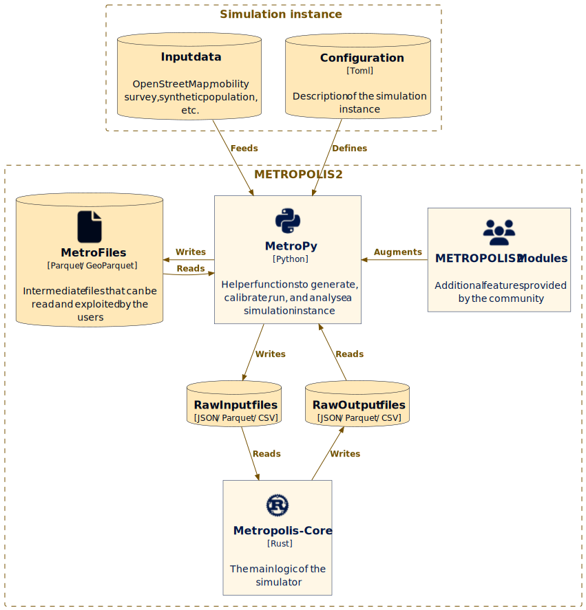

# Introduction

<b>WARNING!</b>

THIS DOCUMENTATION IS A WORK-IN-PROGRESS, MANY CHAPTERS ARE STILL EMPTY

## METROPOLIS2

METROPOLIS2 is an agent-based transport simulator.

Its main features are:

- 🚘 Mode choice (with an arbitrary number of modes, road vehicles are explicitly modeled)
- ⏱️ Continuous-time departure-time choice
- 🛣️ Deterministic route choice (for road vehicles)
- 👫 Agent based (each agent is an autonomous entity with its own characteristics and choices)
- 🚦 Modeling of road congestion (using speed-density functions and bottlenecks)
- ⏸️ Intermediary stops (with schedule preferences and stopping time at each intermediary point)

METROPOLIS2 is composed of

- `Metropolis-Core`: a command line tool to run the transport simulations, written in Rust 🚀
- `MetroPy`: a command line tool to interact with METROPOLIS2's input and output data, written in
  Python 🐍

## What is this book?

This is the official documentation of METROPOLIS2, intended for anyone wanting to learn how to
use the simulator and how it works.

It is devided in 6 chapters:
- [Chapter 1: MetroPy user guide](metropy/index.html)
- [Chapter 2: Metropolis-Core reference](getting_started/index.html)
- [Chapter 3: Advanced topics](advanced/index.html)
- Chapter 4: Theoretical foundations
- [Chapter 5: Implementation details](implementation/index.html)
- [Chapter 6: External tools](tools/index.html)

<!-- ## Contributing -->

<!-- ## Licence -->
