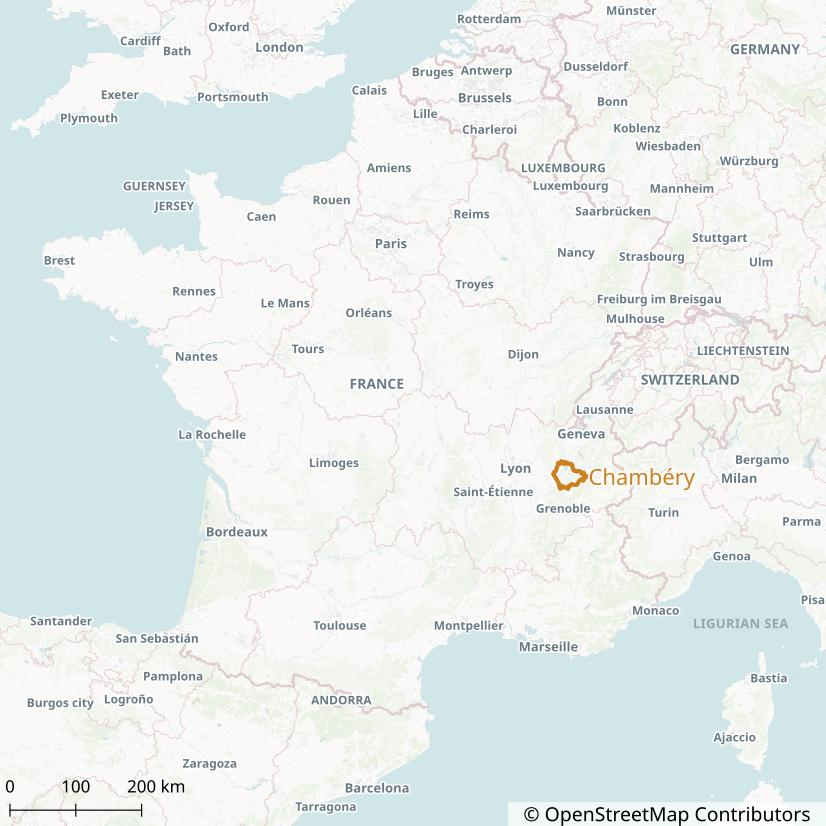
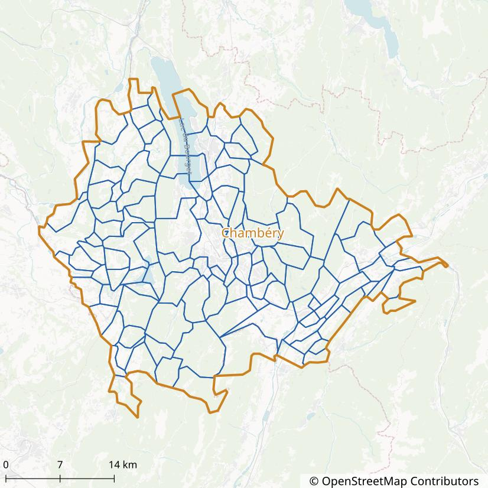
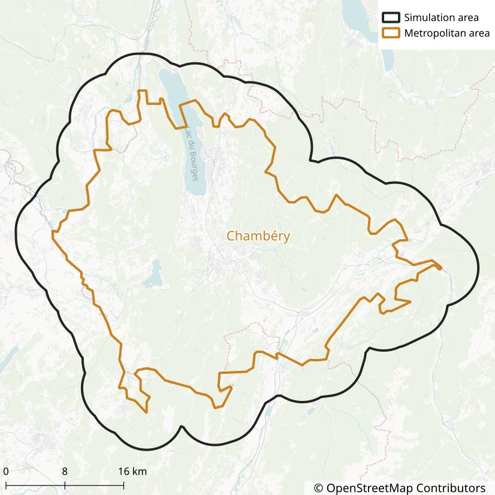
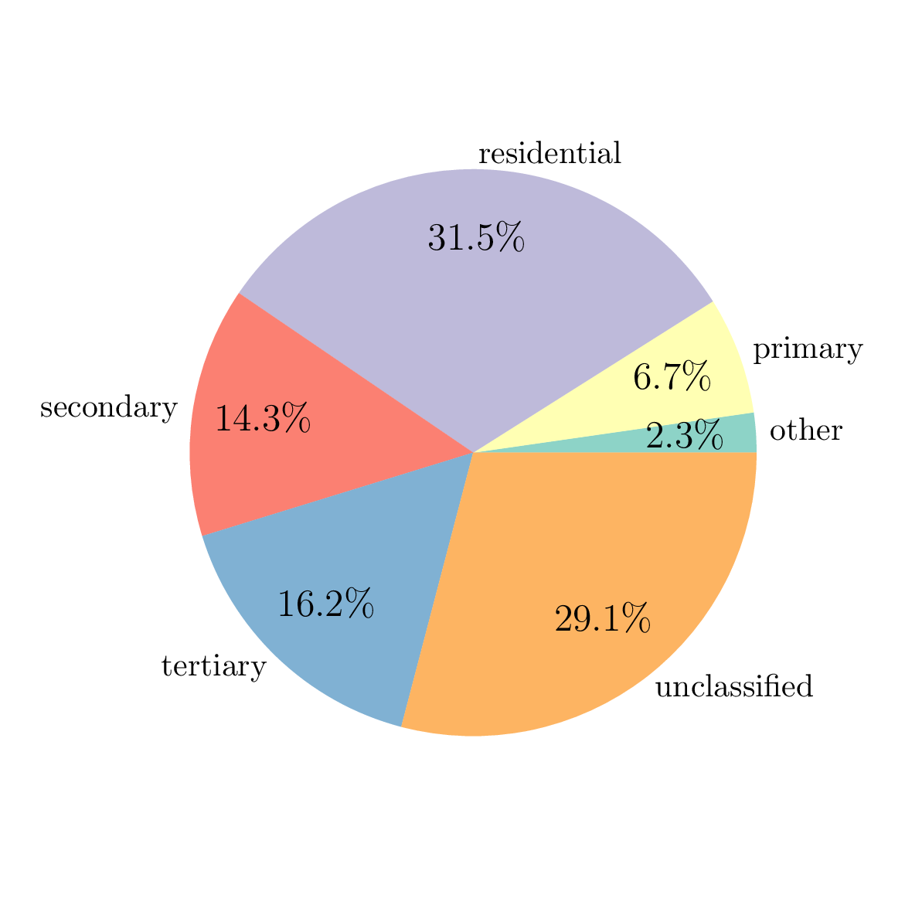
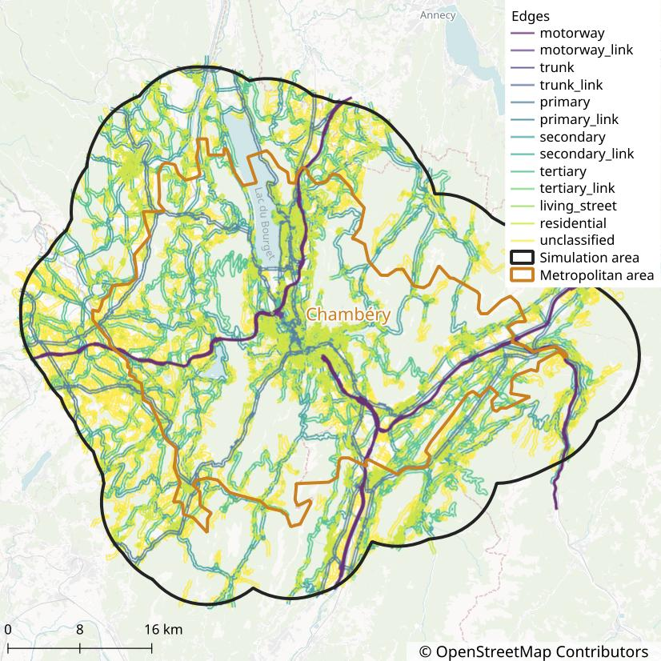
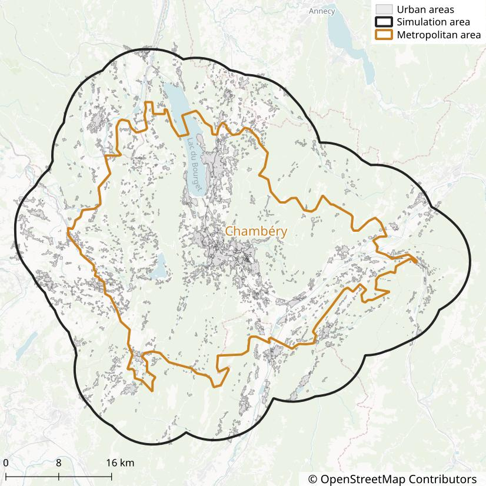

# Case Study 1: Chambéry

**Table of Contents**

<!-- toc -->

## Chambéry

[Chambéry](https://en.wikipedia.org/wiki/Chamb%C3%A9ry) is a French city in the Savoie department,
near the Alps.
In 2021, the population of Chambéry was 59,856.

<figure style="max-width:800px;margin:auto">
    <a title="Florian Pépellin, CC BY-SA 3.0 &lt;https://creativecommons.org/licenses/by-sa/3.0&gt;, via Wikimedia Commons" href="https://commons.wikimedia.org/wiki/File:Chamb%C3%A9ry_-_Belledonnes_(Savoie).JPG">
        
    </a>
    <figcaption style="text-align:center">Panorama of Chambéry</figcaption>
</figure>

<figure style="max-width:600px;margin:auto">
    
    <figcaption style="text-align:center">Location of Chambéry in France</figcaption>
</figure>

It is the largest city of the **Chambéry Metropolitan area** (*Aire d'attraction de Chambéry*) which
has a population of 261,463 and an area of 1,147 km² (2021).
The Metropolitan area of Chambéry consists of 115 French municipalities.

<figure style="max-width:600px;margin:auto">
    
    <figcaption style="text-align:center">The 115 municipalities in the Chambéry Metropolitan area</figcaption>
</figure>

Chambéry has been selected for this case study due to its small size (reducing running times) and
the availability of a recent travel survey (2022).

## General Configuration

Before running the metropy pipeline, we need to create the TOML configuration file that specifies
all the parameters of the simulation.

Create the `config-chambery.toml` file with the following content:

```toml
# File: config-chambery.toml
main_directory = "./chambery/output/"
crs = "EPSG:2154"
osm_file = "./chambery/data/rhone-alpes-250101.osm.pbf"
```

The `main_directory` variable represents the directory in which all the output files generated by
the pipeline will be saved.
The directory will be created automatically if it does not exist yet.

The `crs` variable represents the projected coordinate system to be used for all operations with
the spatial data (such as measuring the length of the road links).
The value `"EPSG:2154"` represents the [Lambert-93 projection](https://epsg.io/2154), which is
adapted for any area in Metropolitan France.

The `osm_file` variable specifies the path to the OpenStreetMap input file that will be used to
import the road and walking network.
We use the extract of the Rhône-Alpes French administrative region from 2025-01-01, that can be
downloaded from [Geofabrik](https://download.geofabrik.de/europe/france/rhone-alpes.html) (click on
`raw directory index` to access older versions).
The Rhône-Alpes region is adapted for our case study given that the Chambéry urban area is full
contained within it.

## Simulation Area

- **Step:** `simulation-area`
- **Running time:** 2 seconds

We define the simulation area as the Chambéry Metropolitan area *(aire d'attraction)* so that we get
an area large enough to encompass most of the trips from and to Chambéry's municipality.

To tell metropy to create the simulation area from the Chambéry Metropolitan area, add the following
section to the configuration:

```toml
[simulation_area]
aav_name = "Chambéry"
buffer = 8000
```

The `buffer = 8000` line tells metropy to extend the area by 8 kilometers in all directions.
This is used to include roads in the simulation that are not inside the Metropolitan area but that
could be taken when traveling between two municipalities within the area.

The output file `./chambery/output/simulation_area.parquet` can be opened with QGIS to draw a map.

<figure style="max-width:600px;margin:auto">
    
    <figcaption style="text-align:center">
        Chambéry Metropolitan area and the buffered simulation area
    </figcaption>
</figure>

## OpenStreetMap Road Import

- **Step:** `osm-road-import`
- **Running time:** 2 minutes

We use the `osm-road-import` step to import the road network from OpenStreetMap.
The step will read the `osm_file` variable previously defined.

Add the following section to the configuration:

```toml
[osm_road_import]
highways = [
  "motorway",
  "motorway_link",
  "trunk",
  "trunk_link",
  "primary",
  "primary_link",
  "secondary",
  "secondary_link",
  "tertiary",
  "tertiary_link",
  "living_street",
  "unclassified",
  "residential",
]
urban_landuse = [
  "commercial",
  "construction",
  "education",
  "industrial",
  "residential",
  "retail",
  "village_green",
  "recreation_ground",
  "garages",
  "religious",
]
urban_buffer = 50
```

The `highways` parameter lists all the OSM
[highway tags](https://wiki.openstreetmap.org/wiki/Key:highway) to be imported.
In this case, all the standard tags are considered, including living streets, residential streets
and unclassified streets.
We do not consider however the `service` and `road` tags, which usually represent car park alleys or
other special roads we are not interested in.

The `urban_landuse` parameter lists all the OSM
[landuse tags](https://wiki.openstreetmap.org/wiki/Key:landuse) to be classified as urban.
The roads which are fully contained within urban areas will be classified as "urban".
The urban areas are extended by 50 meters, through the `urban_buffer` parameter, so that roads
partially outside urban areas are also classified as "urban".

After the step is completed, some statistics are reported in the file
`./chambery/output/osm-road-import/output.txt`.
They show that the imported road network has:

- 37 088 nodes
- 77 884 edges
- The total length of edges is 13 990 km
- 69.4 % of edges are classified as "urban"
- 2.2 % of edges are roundabouts
- 0.5 % of edges have traffic signals
- 1.0 % of edges have a stop sign
- 1.3 % of edges have a give-way sign
- 1.0 % of edges have tolls
- 68.7 % of edges do not have a speed limit reported
- 84.4 % of edges do not have a number of lanes reported

The directory `./chambery/output/graphs/osm-road-import/` also contains some graphs generated from
the imported data.
For example, the following pie chart reports the share of edges by road type (the category "other"
regroup all road types with few observations).

<figure style="max-width:500px;margin:auto">
    
    <figcaption style="text-align:center">
        Share of edges by road type
    </figcaption>
</figure>

The two output files `./chambery/output/osm-road-import/edges_raw.parquet` and
`./chambery/output/osm-road-import/urban_areas.parquet` can be opened with QGIS to draw a map of
edges...

<figure style="max-width:600px;margin:auto">
    
    <figcaption style="text-align:center">
        Edges imported from OSM, by road type
    </figcaption>
</figure>

and urban areas...

<figure style="max-width:600px;margin:auto">
    
    <figcaption style="text-align:center">
        Areas classified as "urban" from OSM
    </figcaption>
</figure>
