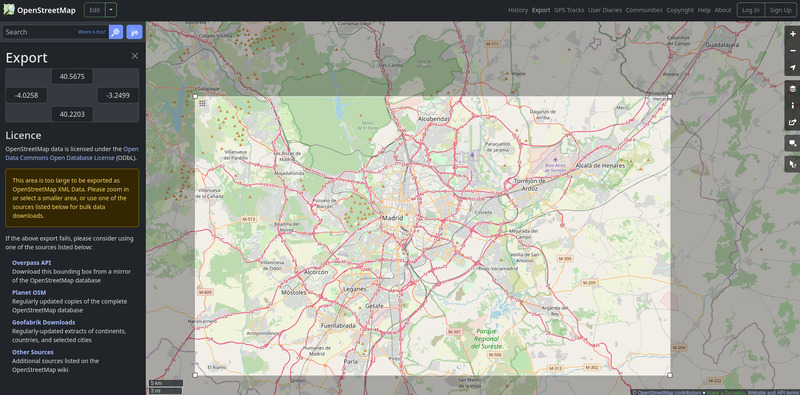
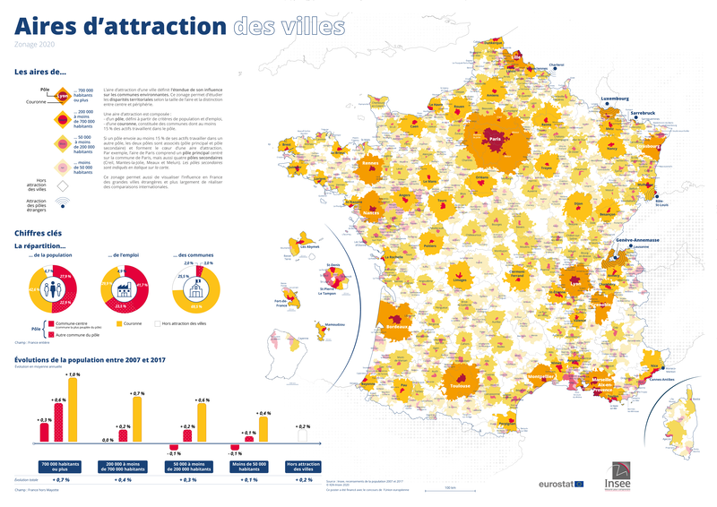
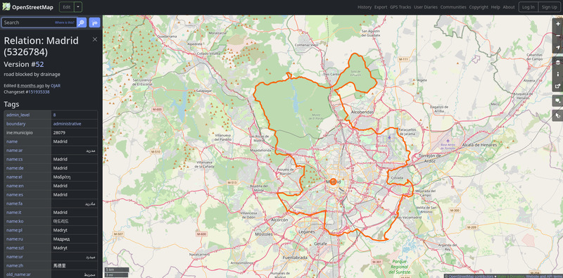

# Steps

**Table of Contents**

<!-- toc -->

## Step `simulation-area`

- **Description:** The `simulation-area` step creates a polygon of the simulation area in which all
  trips take place. The polygon is used, for example, to filter out roads outside the simulation area.
- **Requirements:** Optional (default is to not filter by any area).
- **Prerequisite:** None
- **Output file(s):** [Simulation area](files.md#simulation-area)
- **Estimated running time:** A few seconds (except for large OpenStreetMap imports).

There are 4 different ways to generate the polygon, described below.

### Method 1: Providing a bounding box

The easiest way to specify the simulation area is to define its bounding box. This however means
that the area is limited to rectangles.

The bounding box needs to be specified as the `bbox` value, which expects a list of coordinates
`[minx, miny, maxx, maxy]`.

By default, the coordinates need to be specified in the simulation CRS.
If you want to specify them in WGS84 (longitude, latitude), you can use `bbox_wgs = true`.

You can go to [www.openstreetmap.org](https://www.openstreetmap.org) to identify the bounding box of
a region (as WGS84 coordinates), using the "Export" button.

<figure style="max-width:800px;margin:auto">
    
    <figcaption style="text-align:center">Getting bounding box from OpenStreetMap</figcaption>
</figure>


```toml
[simulation_area]
bbox = [1.4777, 48.3955, 3.6200, 49.2032]
bbox_wgs = true
```

### Method 2: Providing a geospatial file with polygon(s)

If you already have a set of polygons which jointly form the entire area (e.g., the administrative
boundaries of all municipalities to be considered), you can simply provide as input a geospatial
file with those polygons.
Then, metropy will read the file and define the polygon of the simulation area as the union of all
polygons.
If there is a single polygon (e.g., the administrative boundary of the region to be considered),
metropy will simply use it as the simulation area polygon.

The file can use any GIS format that can be read by geopandas (e.g., Parquet, Shapefile, GeoJson).
It needs to be specified as the `polygon_file` value.

```toml
[simulation_area]
polygon_file = "path/to/polygon/filename"
```

### Method 3: Reading a French metropolitan area

A French metropolitan area (*aire d'attraction d'une ville*) is a type of statistical area defined
by the French national statistics office INSEE.
It is defined by considering the commuting patterns between cities, making it well adapted to define
areas for transport simulations.

<figure style="max-width:800px;margin:auto">
    <a href="https://www.insee.fr/fr/statistiques/fichier/4803954/poster_zaav.png">
        
    </a>
    <figcaption style="text-align:center">Map of French metropolitan areas. Source: INSEE</figcaption>
</figure>

The database for these *aires d'attraction des villes* is publicly available on the
[INSEE website](https://www.insee.fr/fr/information/4803954).
Metropy can automatically download the database and read the polygon of an area if you set the
`aav_name` parameter to one of the existing area.
The areas' name is usually the name of the biggest city in the area.

```toml
[simulation_area]
aav_name = "Paris"
```

If the automatic download does not work, you can download the file locally and tell metropy to use
that version:

- Go to the INSEE page of the *aires d'attraction des villes* database:
  [https://www.insee.fr/fr/information/4803954](https://www.insee.fr/fr/information/4803954)
- Download the zip file "Fonds de cartes des aires d'attraction des villes 2020 au 1er janvier 2024"
- Unzip the file. You will get two zip files representing shapefiles: `aav2020_2024.zip` (polygons
  of the areas) and `com_aav2020_2024.zip` (polygons of the municipalities). Only the former is
  needed.
- In the section `[simulation_area]` of the configuration, add the lines
  `aav_filename = "path/to/aav2020_2024.zip"` and `aav_name = "YOUR_AAV_NAME"`.

```toml
[simulation_area]
aav_name = "Paris"
aav_filename = "path/to/aav2020_2024.zip"
```

### Method 4: Reading OpenStreetMap's administrative boundaries

Administrative boundaries of various subdivisions are specified directly on OpenStreetMap (e.g.,
states, counties, municipalities), with the tags
[`admin_level=*`](https://wiki.openstreetmap.org/wiki/Key:admin%20level) and
[`boundary=administrative`](https://wiki.openstreetmap.org/wiki/Tag:boundary%3Dadministrative).
The OpenStreetMap wiki has a
[table](https://wiki.openstreetmap.org/wiki/Tag:boundary%3Dadministrative#Table_:_Admin_level_for_all_countries)
indicating the meaning of each `admin_level` value by country.
For example, `admin_level=6` represents counties in the U.S. and *départements* in France.

You can use metropy to create the simulation area by reading one or more administrative
boundaries from OpenStreetMap data.
First, you need to set the `osm_file` value to the path to the OpenStreetMap file.
In the `[simulation_area]` section, the `osm_admin_level` value represents the `admin_level` value
to be used as filter and the `osm_name` value is a list of the subdivisions names to be selected.

For example, to get the polygon of Madrid, you can use:

```toml
osm_file = "path/to/spain.osm.pbf"

[simulation_area]
osm_admin_level = 8
osm_name = ["Madrid"]
```

<figure style="max-width:800px;margin:auto">
    
    <figcaption style="text-align:center">Madrid administrative boundaries from OpenStreetMap</figcaption>
</figure>

Or, to get the polygon of Paris and the surrounding departments, you can use:

```toml
osm_file = "path/to/france.osm.pbf"

[simulation_area]
osm_admin_level = 6
osm_name = ["Paris", "Hauts-de-Seine", "Seine-Saint-Denis", "Val-de-Marne"]
```

### Buffering the simulation area's polygon

Regardless of the method used, the `buffer` parameter allows you to extend (or shrink) the polygon
of the simulation area by a given amount, expressed in the unit measure of the CRS (usually meters).
Use positive values to extend the area, and negative values to shrink it.

```toml
[simulation_area]
polygon_file = "path/to/polygon/filename"
buffer = 500
```

## Step `osm-road-import`

- **Description:** Extract the road network, as a graph of directed edges, from OpenStreetMap data.
- **Requirements:** Required.
- **Prerequisite:** `simulation-area` (optional)
- **Output file(s):** [Raw edges](files.md#raw-edges), [Urban areas](files.md#urban-areas) (if
  `urban_landuse` is set)
- **Estimated running time:** TODO

```toml
# Example configuration.
[osm_road_import]
highways = [
  "motorway",
  "motorway_link",
  "trunk",
  "trunk_link",
  "primary",
  "primary_link",
  "secondary",
  "secondary_link",
  "tertiary",
  "tertiary_link",
  "living_street",
  "unclassified",
  "residential",
]
urban_landuse = [
  "commercial",
  "construction",
  "education",
  "industrial",
  "residential",
  "retail",
]
urban_buffer = 50
```

With this step, metropy will read the OpenStreetMap data from `osm_file` and will select all the
ways which satisfy all the following criteria:

- The way has a [`highway`](https://wiki.openstreetmap.org/wiki/Key:highway) tag whose value is in
  the [`highways`](configuration.md#highways) configuration parameter.
- The way does not have a [`access`](https://wiki.openstreetmap.org/wiki/Key:access) tag or the
  `access` value is equal to `yes`, `permissive` or `destination`.
- The way's geometry intersects with the simulation area polygon (if any).

For each valid way, metropy will read the following tags (when they are specified): `name` (or
`addr:street`, or `ref` as fallback), `toll`, `junction` (to detect roundabouts), `oneway`,
`maxspeed` (or `maxspeed:forward` and `maxspeed:backward`), `lanes` (or `lanes:forward` and
`lanes:backward`).

In addition, metropy will flag the ways with traffic signals, give-way signs and stop signs by
reading the `highway` tag of the ways' nodes.

From the extracted ways and their data, metropy will then create the edges of the road network graph
with the following operations:

- Bidirectional ways (`oneway=no`) are split in two directed edges.
- Ways are divided in multiple edges when a node of the way that is neither the first nor the last
  node is an intersection (i.e., another way is intersecting the middle of this way).

### Urban areas

If the [`urban_landuse`](configuration.md#urban_landuse) configuration parameter is defined, then
metropy will also read all the areas from the OpenStreetMap data to retrieve those matching the
following criteria.

- The area has a [`landuse`](https://wiki.openstreetmap.org/wiki/Key:landuse) tag whose value in in
  the `urban_landuse` values,
- The area's geometry intersects the simulation area polygon (if any).

The geometries of the valid areas will then be buffered based on the `urban_buffer` configuration
parameter and the edges whose geometry is fully contains within urban areas will be flagged as
`urban`.
The urban areas are saved to the [Urban areas file](files.md#urban-areas).

### Additional output

Metropy will output some statistics regarding the operations performed in the file
`osm-road-import/output.txt` and it will generate some graphs in the directory
`graphs/osm-road-import/`.
